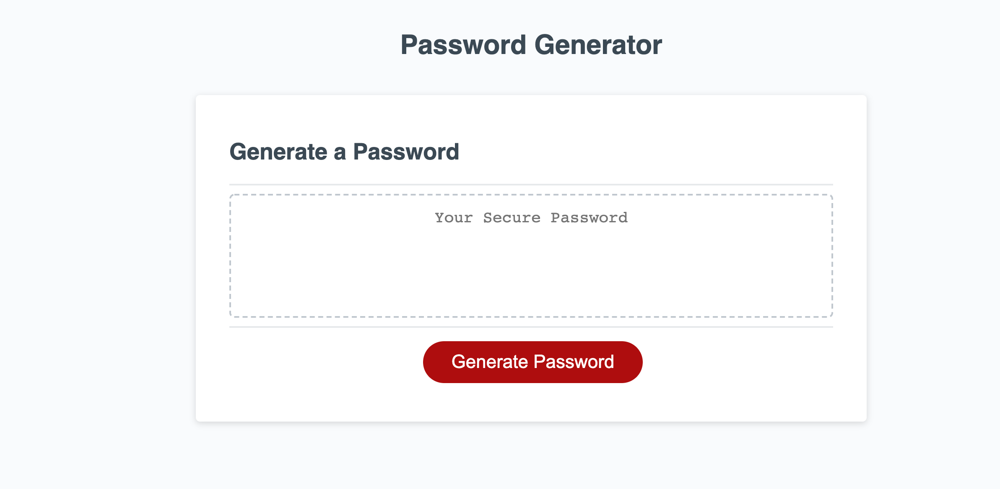
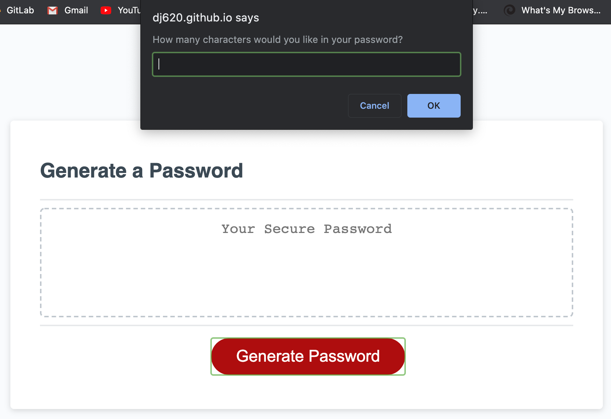
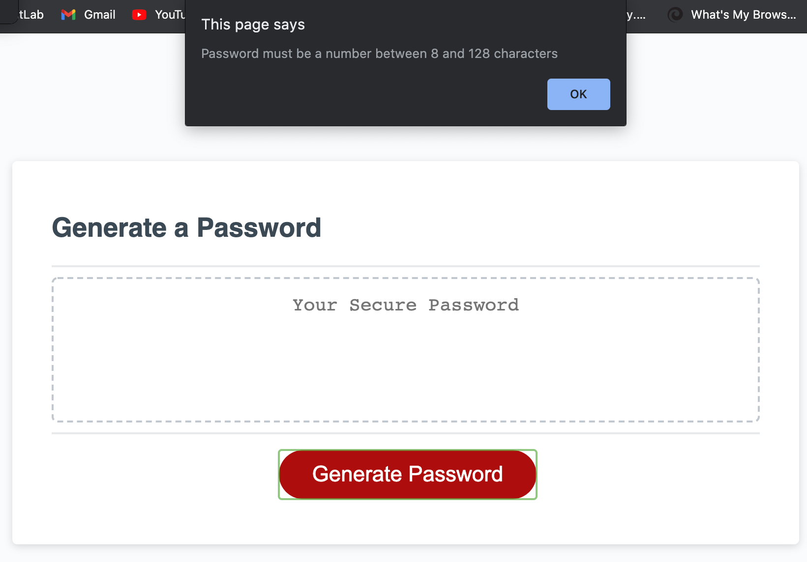
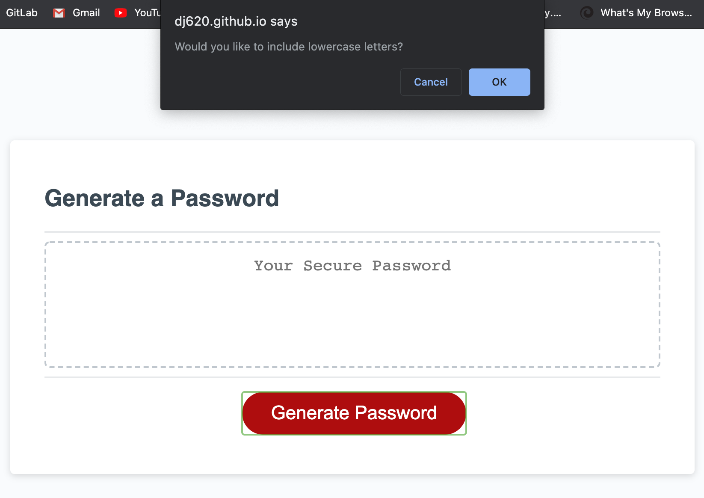
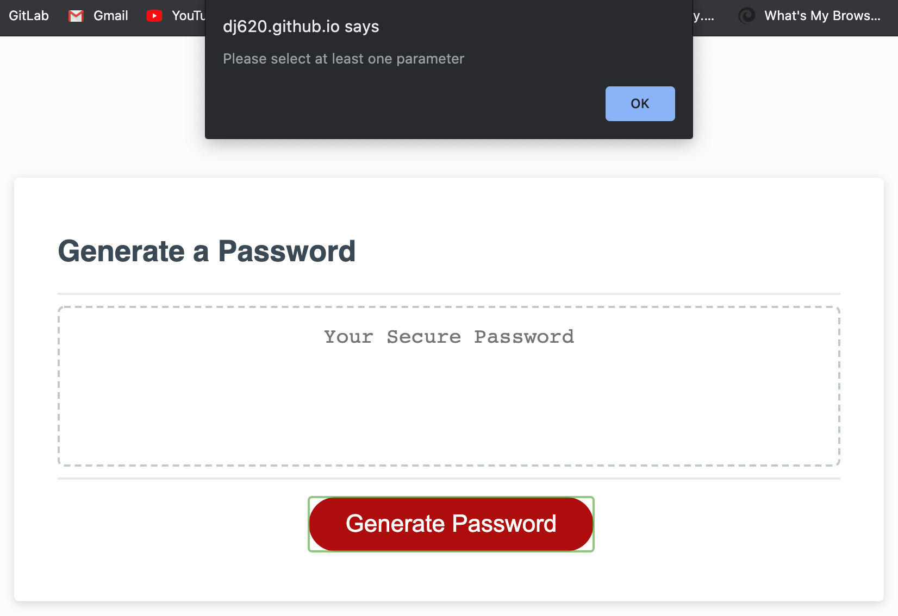
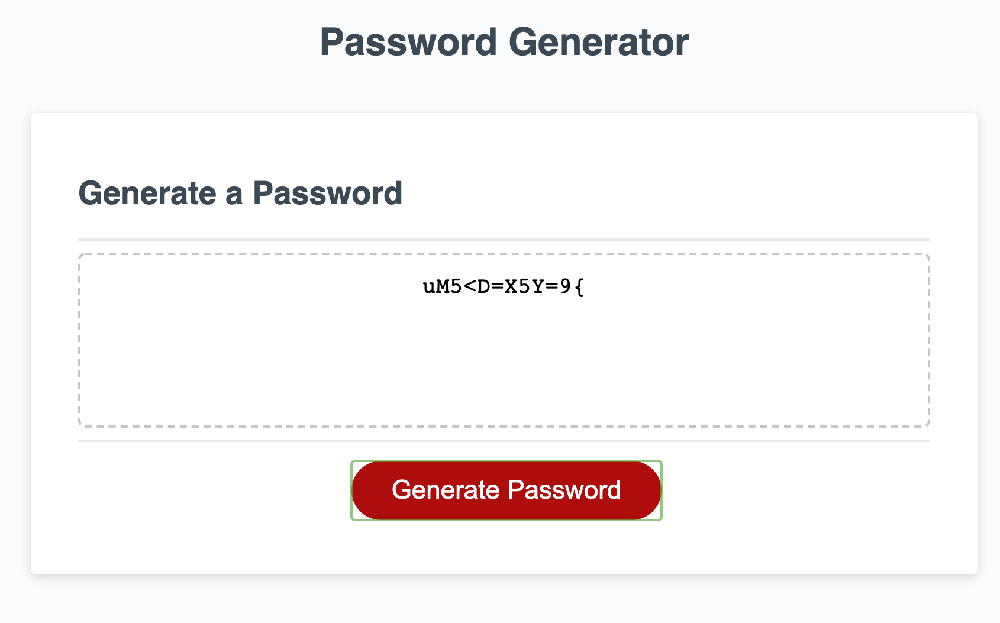

# Password Generator

## Description

This is a password generator. When you click the 'Generate Password' button, you will be prompted to answer several questions about how you want your password to turn out.

This application helps anyone who is looking for a unique password for any sensitive data.

This application was built using a JavaScript algorithm that I, DJ Hersh, wrote myself. The HTML and CSS were provided to me by the UCLA Extension Full-Stack Web Development Coding Bootcamp (instructor: Bryan Swarthout).

## Table of Contents

* [Link](#link)
* [Usage](#usage)
* [Credits](#credits)
* [License](#license)

## Link

https://dj620.github.io/password-generator/

## Usage

To use the password generator, simply navigate to the page and click the 'Generate Password' button. You will first be prompted to enter how many characters you would like in your password. 

If you enter a number smaller than 8 or larger than 128, or any character that isn't a number, you will get an alert that informs you that the length must be a number between 8 and 128.

You will then get a series of prompts asking if you would like the password to include lowercase letters, uppercase letters, numbers, and/or special characters. 

If you do not choose any of these criteria, you will see an alert that says you must select at least one, and will be asked all four questions again.

After you have answered that you want to include at least one of the given criteria, a password of your specified length will display inside the text-box. The algorithm ensures that at least one of each type of character is included.

## Credits

As I stated in my description, the HTML and CSS were provided by the UCLA Extension Full-Stack Web-Development Coding Bootcamp (instructor: Bryan Swarthout).

http://www.uclaextension.edu

In addition to what I have learned from my bootcamp, I also learned a great deal from the websites CodeCademy and FreeCodeCamp

http://www.codecademy.com

http://freecodecamp.com

## License

MIT License

Copyright (c) [year] [fullname]

Permission is hereby granted, free of charge, to any person obtaining a copy
of this software and associated documentation files (the "Software"), to deal
in the Software without restriction, including without limitation the rights
to use, copy, modify, merge, publish, distribute, sublicense, and/or sell
copies of the Software, and to permit persons to whom the Software is
furnished to do so, subject to the following conditions:

The above copyright notice and this permission notice shall be included in all
copies or substantial portions of the Software.

THE SOFTWARE IS PROVIDED "AS IS", WITHOUT WARRANTY OF ANY KIND, EXPRESS OR
IMPLIED, INCLUDING BUT NOT LIMITED TO THE WARRANTIES OF MERCHANTABILITY,
FITNESS FOR A PARTICULAR PURPOSE AND NONINFRINGEMENT. IN NO EVENT SHALL THE
AUTHORS OR COPYRIGHT HOLDERS BE LIABLE FOR ANY CLAIM, DAMAGES OR OTHER
LIABILITY, WHETHER IN AN ACTION OF CONTRACT, TORT OR OTHERWISE, ARISING FROM,
OUT OF OR IN CONNECTION WITH THE SOFTWARE OR THE USE OR OTHER DEALINGS IN THE
SOFTWARE.
